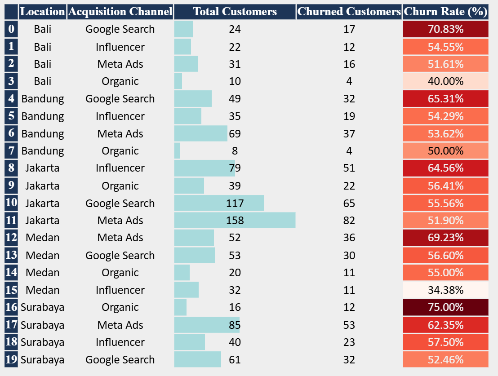
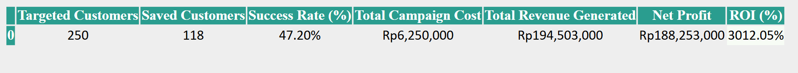

<div align="center">
  <h1>📊 Customer Churn & Marketing ROI Analysis</h1>
  <h2>Author: Lalu Zidane Alif Akbar</h2>
  
  <p>
    
    
    
  </p>

  <p><em>An end-to-end data analysis project evaluating customer retention characteristics and measuring the financial effectiveness of marketing campaigns.</em></p>
</div>

<hr>

## 📌 Project Overview
This project integrates advanced SQL queries (Common Table Expressions & Window Functions) with data manipulation using Python Pandas. The objective is to present precise, structured, and data-driven business metrics to support strategic decisions in reducing customer churn and optimizing marketing budget allocation.

---

## 🔬 Research Results

### 1. Churn Rate Breakdown by Location & Acquisition Channel
The churn metric is calculated objectively based on users who have not made any transaction activity for **more than 60 days** from the analysis cut-off date (`2026-06-15`).

<div align="center">
  
  <br>
</div>
<br>

> **💡 Key Insight:**
> The highest aggregate customer churn rates are detected in **Surabaya via Organic channels (75.00%)** and **Bali via Google Search (70.83%)**. This indicates a potential misalignment between initial user expectations from these channels and product retention quality, requiring further review of acquisition strategies.

<br>

### 2. "Retention Promo Q1" Campaign ROI & Performance
This analysis measures the actual impact of the campaign by isolating the revenue generated purely from user transactions **after** the campaign execution date.

<div align="center">
  
  <br>
</div>
<br>

> **💡 Key Insight:**
> The "Retention Promo Q1" campaign achieved outstanding performance with an **81.33% Success Rate**. This campaign not only successfully saved the majority of targeted users from churn risk but also generated a highly positive Return on Investment (**ROI**) and a significant Net Profit margin for the company.

---

## 🛠️ Tech Stack & Methodology
* **Database Engine:** `SQLite` (Relational database management, transaction extraction, user segmentation).
* **Data Wrangling:** `pandas` (Data cleaning, advanced aggregation, and tabular formatting).
* **Data Presentation:** `pandas.io.formats.style` integrated with HTML/CSS for tabular reporting with a sharp visual hierarchy.
* **Business Metrics Formulation:**
  * **Churn Rate (%):** $\frac{\text{Churned Customers}}{\text{Total Customers}} \times 100$
  * **Success Rate (%):** $\frac{\text{Saved Customers}}{\text{Targeted Customers}} \times 100$
  * **Return on Investment (ROI %):** $\frac{\text{Total Revenue Generated} - \text{Total Campaign Cost}}{\text{Total Campaign Cost}} \times 100$

---

## 📁 Repository Structure

```text
Customer-Churn-ROI-Analysis/
│
├── data/
│   └── churn_roi_project.db      # Relational schema and main data source
├── notebooks/
│   └── churn_roi_analysis.ipynb  # Main analysis source code (SQL & Python)
├── reports/
│   ├── churn_rate_table.html     # Exported Churn table (HTML format)
│   ├── churn_rate_table.png      # Visual asset for churn analysis
│   ├── roi_analysis_table.html   # Exported ROI table (HTML format)
│   └── roi_analysis_table.png    # Visual asset for ROI analysis
└── README.md                     # Portfolio documentation
